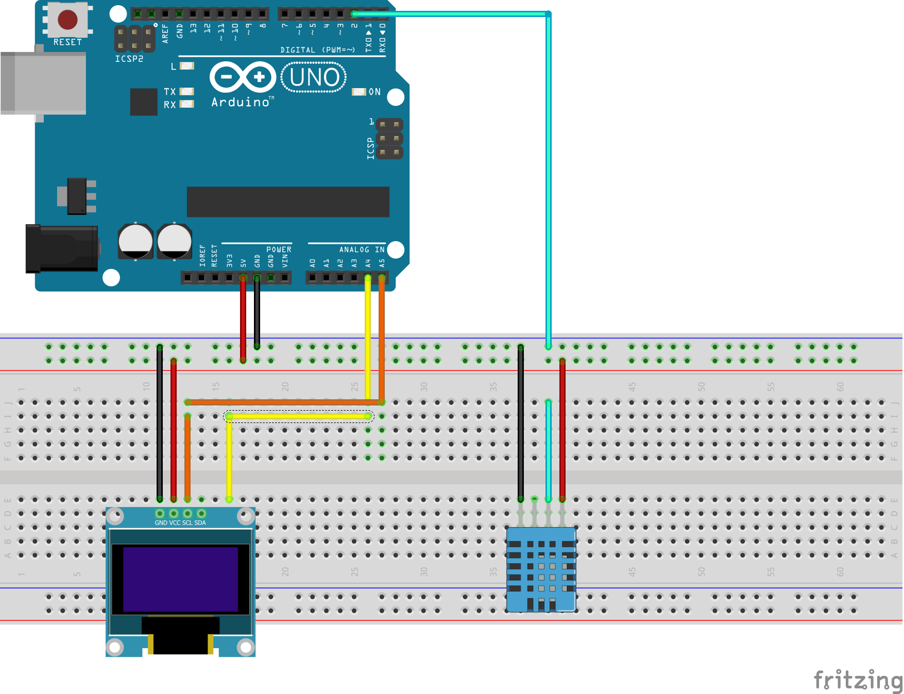

# DHT-sensor-with-SSD-1306
A simple way to show real temperature and Humidity with DH11 Sensor and OLED SSD 1306

## Parts needed:
  * Arduino Uno
  * OLED SSD 1306 128x64
  * [Adafruit GFX library](https://github.com/adafruit/Adafruit-GFX-Library)
  * [Adafruit SSD 1306 library](https://github.com/adafruit/Adafruit_SSD1306)
 
## Schematics

### Disclaimer
All in here its free to use and learn, but if you use this on any project please leave comment mentioning the source
GOOD LUCK!
